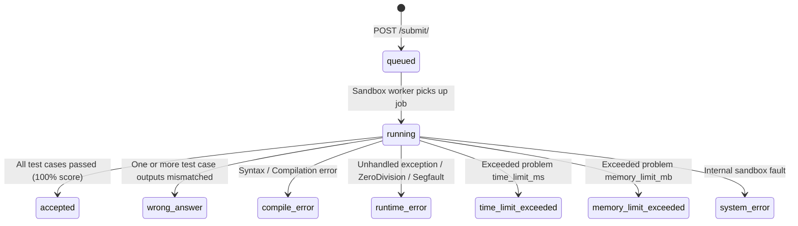

# Online Code Assessment — Frontend Integration Specification

> **Target Audience**: Frontend Engineering Team & AI Coding Agents
> **Module Name**: `code_assessment`
> **Status**: Production-Ready
> **Version**: `1.0.0`

---

## 1. Overview

The **Online Code Assessment Module** is a high-performance, sandboxed coding practice and evaluation platform (similar to LeetCode and HackerRank) built into the ARYU Learning Management System.

It empowers students to:

1. Browse coding problems filtered by course, difficulty, and algorithm topics.
2. Write solutions directly in an online code editor supporting **Python 3, JavaScript (Node.js), Java, C++, and C**.
3. **Run Code** instantly against public sample test cases or custom standard input (stdin).
4. **Submit Solution** for official grading against strict hidden test cases evaluated in an isolated, secure backend sandbox.
5. Participate in timed or untimed **Course Coding Assessments** with automated scoring and progress tracking.

---

## 2. Authentication Architecture

The module uses the existing ARYU **JWT (JSON Web Token)** authentication system.

- **Header**:
  ```http
  Authorization: Bearer <access_token>
  ```
- **User Identity**: The backend automatically extracts and resolves the student identity directly from the verified JWT payload and the existing `Student` model. **The frontend must never send or fake `student_id` or `is_staff` in request bodies.**

---

## 2.1 Student Identity

The backend uses the existing `Student` table (`aryuapp_student`) as the single source of truth.

- The frontend must **NOT** send `student_id` for normal student submission requests.
- The authenticated backend request is used to resolve the current `Student`.
- Do not store or duplicate student name/email information in the coding assessment client state unless it is required by an existing UI feature.

---

## 3. Base URL & Environment Configuration

Configure the backend API base URL using environment variables:

```env
# Production
VITE_API_BASE_URL=https://portal.aryuacademy.com/api/code-assessment

# Staging
VITE_API_BASE_URL=https://staging.aryuacademy.com/api/code-assessment

# Local Development
VITE_API_BASE_URL=http://localhost:8000/api/code-assessment
```

---

## 4. API Endpoints Reference

| Method   | Endpoint                                             | Auth Required | Description                                        |
| :------- | :--------------------------------------------------- | :-----------: | :------------------------------------------------- |
| `GET`  | `/api/code-assessment/problems/`                   |   Optional   | List active problems (with filters & search)       |
| `GET`  | `/api/code-assessment/problems/{slug}/`            |   Optional   | Get problem detail + sample test cases             |
| `POST` | `/api/code-assessment/problems/{slug}/run/`        | **Yes** | Test run code against sample cases or custom input |
| `POST` | `/api/code-assessment/problems/{slug}/submit/`     | **Yes** | Submit solution for official scoring               |
| `GET`  | `/api/code-assessment/submissions/`                | **Yes** | List student's own submission history              |
| `GET`  | `/api/code-assessment/submissions/{id}/`           | **Yes** | Get submission detail (IDOR protected)             |
| `GET`  | `/api/code-assessment/submissions/{id}/result/`    | **Yes** | Poll evaluation status and test case results       |
| `GET`  | `/api/code-assessment/assessments/`                |   Optional   | List active coding assessments                     |
| `GET`  | `/api/code-assessment/assessments/{slug}/`         |   Optional   | Get assessment details with attached problems      |
| `GET`  | `/api/code-assessment/assessments/{slug}/summary/` | **Yes** | Get student's score summary on an assessment       |

---

## 5. Detailed Endpoint Contracts

### 5.1 GET `/api/code-assessment/problems/`

#### Purpose

Retrieve a paginated list of active coding problems.

#### Query Parameters

- `difficulty` *(optional)*: `easy` | `medium` | `hard`
- `tag` *(optional)*: Topic tag (e.g. `array`, `string`, `dynamic-programming`, `tree`)
- `course_id` *(optional)*: Integer ID of associated course (e.g. `113` for Python FullStack)
- `search` *(optional)*: Search string in problem title or description

#### Response Example (`200 OK`)

```json
{
  "count": 2,
  "next": null,
  "previous": null,
  "results": [
    {
      "id": 1,
      "title": "Two Sum",
      "slug": "two-sum",
      "difficulty": "easy",
      "tags": ["array", "hash-table"],
      "supported_languages": ["python", "javascript", "java", "cpp", "c"],
      "total_submissions_count": 1420,
      "accepted_submissions_count": 890,
      "acceptance_rate": 62.68,
      "created_at": "2026-08-27T10:00:00Z"
    },
    {
      "id": 2,
      "title": "Reverse Linked List",
      "slug": "reverse-linked-list",
      "difficulty": "medium",
      "tags": ["linked-list", "recursion"],
      "supported_languages": ["python", "javascript", "java"],
      "total_submissions_count": 950,
      "accepted_submissions_count": 480,
      "acceptance_rate": 50.53,
      "created_at": "2026-08-27T11:00:00Z"
    }
  ]
}
```

---

### 5.2 GET `/api/code-assessment/problems/{slug}/`

#### Purpose

Retrieve full problem description, constraints, supported languages, starter templates, and **visible sample test cases only**.

> [!IMPORTANT]
> Hidden test cases are strictly guarded server-side and **NEVER** returned by this endpoint.

#### Response Example (`200 OK`)

```json
{
  "id": 1,
  "title": "Two Sum",
  "slug": "two-sum",
  "description": "Given an array of integers `nums` and an integer `target`, return indices of the two numbers such that they add up to `target`.\n\nYou may assume that each input would have exactly one solution, and you may not use the same element twice.",
  "difficulty": "easy",
  "constraints": "• 2 <= nums.length <= 10^4\n• -10^9 <= nums[i] <= 10^9\n• -10^9 <= target <= 10^9\n• Only one valid answer exists.",
  "input_format": "Line 1: Space-separated integers representing the array\nLine 2: Single integer representing the target",
  "output_format": "Space-separated indices (0-indexed) of the two numbers",
  "sample_explanation": "Because nums[0] + nums[1] == 9, we return 0 1.",
  "time_limit_ms": 2000,
  "memory_limit_mb": 128,
  "supported_languages": ["python", "javascript", "java", "cpp", "c"],
  "starter_code": {
    "python": "import sys\n\ndef solve():\n    lines = sys.stdin.read().splitlines()\n    if not lines:\n        return\n    nums = [int(x) for x in lines[0].split()]\n    target = int(lines[1])\n    # Write your solution here\n    pass\n\nif __name__ == '__main__':\n    solve()\n",
    "javascript": "const fs = require('fs');\n\nfunction solve() {\n    const input = fs.readFileSync('/dev/stdin', 'utf-8').trim().split('\\n');\n    if (!input || input.length < 2) return;\n    const nums = input[0].split(' ').map(Number);\n    const target = Number(input[1]);\n    // Write your solution here\n}\n\nsolve();\n"
  },
  "tags": ["array", "hash-table"],
  "sample_test_cases": [
    {
      "id": 101,
      "input_data": "2 7 11 15\n9",
      "expected_output": "0 1",
      "is_sample": true,
      "explanation": "nums[0] + nums[1] == 2 + 7 == 9",
      "order": 1
    },
    {
      "id": 102,
      "input_data": "3 2 4\n6",
      "expected_output": "1 2",
      "is_sample": true,
      "explanation": "nums[1] + nums[2] == 2 + 4 == 6",
      "order": 2
    }
  ],
  "total_submissions_count": 1420,
  "accepted_submissions_count": 890,
  "acceptance_rate": 62.68,
  "created_at": "2026-08-27T10:00:00Z"
}
```

---

### 5.3 POST `/api/code-assessment/problems/{slug}/run/`

#### Purpose

Executes student code synchronously against sample test cases OR against custom standard input provided by the student in the UI editor.

#### Request Headers

```http
Authorization: Bearer <access_token>
Content-Type: application/json
```

#### Request Body Schema

```json
{
  "language": "python",
  "source_code": "import sys\n\ndef solve():\n    lines = sys.stdin.read().splitlines()\n    nums = [int(x) for x in lines[0].split()]\n    target = int(lines[1])\n    seen = {}\n    for i, num in enumerate(nums):\n        diff = target - num\n        if diff in seen:\n            print(f'{seen[diff]} {i}')\n            return\n        seen[num] = i\n\nif __name__ == '__main__':\n    solve()\n",
  "custom_input": "" 
}
```

*(Leave `custom_input` empty or omitted to run against all sample test cases)*

#### Response Example: Running Sample Test Cases (`200 OK`)

```json
{
  "success": true,
  "status": "accepted",
  "results": [
    {
      "test_case_id": 101,
      "order": 1,
      "status": "accepted",
      "passed": true,
      "input": "2 7 11 15\n9",
      "expected_output": "0 1",
      "stdout": "0 1",
      "stderr": "",
      "execution_time_ms": 14,
      "explanation": "nums[0] + nums[1] == 2 + 7 == 9"
    },
    {
      "test_case_id": 102,
      "order": 2,
      "status": "accepted",
      "passed": true,
      "input": "3 2 4\n6",
      "expected_output": "1 2",
      "stdout": "1 2",
      "stderr": "",
      "execution_time_ms": 12,
      "explanation": "nums[1] + nums[2] == 2 + 4 == 6"
    }
  ]
}
```

#### Response Example: Running with Custom Input (`200 OK`)

```json
{
  "success": true,
  "is_custom_input": true,
  "status": "completed",
  "stdout": "0 2",
  "stderr": "",
  "compile_output": "",
  "execution_time_ms": 15,
  "memory_used_kb": 18400,
  "error_message": ""
}
```

#### Response Example: Compile / Syntax Error (`200 OK`)

```json
{
  "success": true,
  "status": "compile_error",
  "compile_output": "  File \"solution.py\", line 4\n    for i, num in enumerate(nums\n                               ^\nSyntaxError: '(' was never closed",
  "results": []
}
```

---

### 5.4 POST `/api/code-assessment/problems/{slug}/submit/`

#### Purpose

Submits the solution for official grading. The backend stores a `CodeSubmission` in `queued` status and dispatches background sandbox evaluation.

#### Request Body

```json
{
  "language": "python",
  "source_code": "import sys\n\ndef solve():\n    lines = sys.stdin.read().splitlines()\n    nums = [int(x) for x in lines[0].split()]\n    target = int(lines[1])\n    seen = {}\n    for i, num in enumerate(nums):\n        diff = target - num\n        if diff in seen:\n            print(f'{seen[diff]} {i}')\n            return\n        seen[num] = i\n\nif __name__ == '__main__':\n    solve()\n",
  "assessment_id": null
}
```

#### Response Example (`201 Created`)

```json
{
  "submission_id": 482,
  "status": "queued",
  "message": "Submission received and queued for evaluation.",
  "submitted_at": "2026-08-27T12:40:00.123456Z"
}
```

---

### 5.5 GET `/api/code-assessment/submissions/{id}/result/`

#### Purpose

Polling endpoint to check submission status and retrieve detailed grading results.

#### Polling Logic

- Poll every **1.5 seconds** while `status === 'queued'` or `status === 'running'`.
- Stop polling once a terminal status is returned: `accepted`, `wrong_answer`, `compile_error`, `runtime_error`, `time_limit_exceeded`, `memory_limit_exceeded`, `system_error`.
- Maximum timeout: **30 seconds** (if not completed by 30s, display retry prompt).

#### Response Example: Graded Solution (`200 OK`)

```json
{
  "id": 482,
  "user_id": "142",
  "user_name": "Siva Arun",
  "problem": 1,
  "problem_title": "Two Sum",
  "problem_slug": "two-sum",
  "assessment": null,
  "language": "python",
  "source_code": "...",
  "status": "accepted",
  "score": "100.00",
  "total_test_cases": 15,
  "passed_test_cases": 15,
  "execution_time_ms": 28,
  "memory_used_kb": 19450,
  "error_message": "",
  "compile_output": "",
  "test_case_results": [
    {
      "id": 1801,
      "test_case_id": 101,
      "is_sample": true,
      "status": "accepted",
      "execution_time_ms": 14,
      "memory_used_kb": 18200,
      "stdout": "0 1",
      "stderr": "",
      "error_message": ""
    },
    {
      "id": 1802,
      "test_case_id": 103,
      "is_sample": false,
      "status": "accepted",
      "execution_time_ms": 28,
      "memory_used_kb": 19450,
      "stdout": "",
      "stderr": "",
      "error_message": ""
    }
  ],
  "submitted_at": "2026-08-27T12:40:00.123456Z",
  "completed_at": "2026-08-27T12:40:01.890123Z"
}
```

---

### 5.6 GET `/api/code-assessment/assessments/{slug}/`

#### Purpose

Fetch full assessment information and the list of problems assigned to this assessment.

#### Response Example (`200 OK`)

```json
{
  "id": 5,
  "title": "Python Developer Internship Coding Round",
  "slug": "python-developer-internship-coding-round",
  "description": "Timed coding assessment consisting of 3 problems. Complete within 90 minutes.",
  "course": 113,
  "course_name": "Python FullStack",
  "duration_minutes": 90,
  "passing_percentage": "70.00",
  "start_time": null,
  "end_time": null,
  "is_active": true,
  "created_at": "2026-08-27T08:00:00Z",
  "problems": [
    {
      "id": 10,
      "problem": 1,
      "problem_title": "Two Sum",
      "problem_slug": "two-sum",
      "difficulty": "easy",
      "order": 1,
      "points": 30
    },
    {
      "id": 11,
      "problem": 4,
      "problem_title": "Longest Substring Without Repeating Characters",
      "problem_slug": "longest-substring-without-repeating-characters",
      "difficulty": "medium",
      "order": 2,
      "points": 35
    },
    {
      "id": 12,
      "problem": 7,
      "problem_title": "LRU Cache Implementation",
      "problem_slug": "lru-cache-implementation",
      "difficulty": "hard",
      "order": 3,
      "points": 35
    }
  ]
}
```

---

### 5.7 GET `/api/code-assessment/assessments/{slug}/summary/`

#### Purpose

Retrieves a student's aggregate progress, score percentage, and passing status for an assessment.

#### Response Example (`200 OK`)

```json
{
  "assessment_id": 5,
  "title": "Python Developer Internship Coding Round",
  "total_problems": 3,
  "problems_attempted": 2,
  "problems_solved": 2,
  "total_possible_points": 100,
  "earned_points": 65.0,
  "percentage": 65.0,
  "passing_percentage": 70.0,
  "is_passed": false
}
```

---

## 6. Supported Programming Languages

| Key            | Display Name         | Standard Runner Environment |
| :------------- | :------------------- | :-------------------------- |
| `python`     | Python 3             | Python 3.10+                |
| `javascript` | JavaScript (Node.js) | Node.js 18.x+               |
| `java`       | Java (OpenJDK)       | OpenJDK 17                  |
| `cpp`        | C++ (GCC)            | GCC 11 / C++17              |
| `c`          | C (GCC)              | GCC 11 / C11                |

---

## 7. Submission Status State Machine



---

## 8. TypeScript Type Definitions

```typescript
export type DifficultyLevel = 'easy' | 'medium' | 'hard';
export type SupportedLanguage = 'python' | 'javascript' | 'java' | 'cpp' | 'c';

export type SubmissionStatus = 
  | 'queued'
  | 'running'
  | 'completed'
  | 'accepted'
  | 'wrong_answer'
  | 'compile_error'
  | 'runtime_error'
  | 'time_limit_exceeded'
  | 'memory_limit_exceeded'
  | 'output_limit_exceeded'
  | 'system_error'
  | 'cancelled';

export interface SampleTestCase {
  id: number;
  input_data: string;
  expected_output: string;
  is_sample: boolean;
  explanation?: string;
  order: number;
}

export interface CodingProblemDetail {
  id: number;
  title: string;
  slug: string;
  description: string;
  difficulty: DifficultyLevel;
  constraints: string;
  input_format: string;
  output_format: string;
  sample_explanation: string;
  time_limit_ms: number;
  memory_limit_mb: number;
  supported_languages: SupportedLanguage[];
  starter_code: Record<SupportedLanguage, string>;
  tags: string[];
  sample_test_cases: SampleTestCase[];
  total_submissions_count: number;
  accepted_submissions_count: number;
  acceptance_rate: number;
  created_at: string;
}

export interface TestCaseResult {
  id: number;
  test_case_id: number;
  is_sample: boolean;
  status: SubmissionStatus;
  execution_time_ms: number;
  memory_used_kb: number;
  stdout: string;
  stderr: string;
  error_message?: string;
}

export interface SubmissionDetail {
  id: number;
  user_id: string;
  user_name: string;
  problem: number;
  problem_title: string;
  problem_slug: string;
  assessment?: number | null;
  language: SupportedLanguage;
  source_code: string;
  status: SubmissionStatus;
  score: string;
  total_test_cases: number;
  passed_test_cases: number;
  execution_time_ms: number;
  memory_used_kb: number;
  error_message: string;
  compile_output: string;
  test_case_results: TestCaseResult[];
  submitted_at: string;
  completed_at?: string;
}

export interface AssessmentSummary {
  assessment_id: number;
  title: string;
  total_problems: number;
  problems_attempted: number;
  problems_solved: number;
  total_possible_points: number;
  earned_points: number;
  percentage: number;
  passing_percentage: number;
  is_passed: boolean;
}
```

---

## 9. Frontend UI & UX Best Practices

### 9.1 IDE Workspace Layout

- **Split Pane**: Problem statement (Left pane, 40% width) | Code Editor & Terminal (Right pane, 60% width).
- **Tabs in Terminal Panel**:
  - `Testcase`: Shows sample test cases with an interactive tab for "Custom Testcase".
  - `Result`: Displays execution stdout, stderr, run time, and test pass/fail badges.
- **Action Buttons**:
  - `Run Code` (Secondary button / Shortcut `Ctrl + '` or `Cmd + '`): Triggers `POST /run/`.
  - `Submit` (Primary green button / Shortcut `Ctrl + Enter` or `Cmd + Enter`): Triggers `POST /submit/` and enters polling modal/state.

### 9.2 Rate Limiting & Debounce Defenses

1. **Button Disabling**: Immediately disable both `Run` and `Submit` buttons upon click to prevent double-submitting.
2. **Debounce Polling**: Use exponential or 1.5s interval polling for `/submissions/{id}/result/`. Terminate immediately upon reaching any terminal status (`accepted`, `wrong_answer`, `compile_error`, etc.).
3. **Payload Guard**: Validate locally before transmission:
   - `source_code.length <= 64 * 1024` (64 KB).
   - `custom_input.length <= 64 * 1024` (64 KB).

### 9.3 Security Mandate for Frontend

- **Never attempt to execute code in browser JS to calculate results.**
- **Never assume a problem is passed until the backend evaluation returns `accepted`.**
- **Hidden test case answers must never be requested or guessed.**
